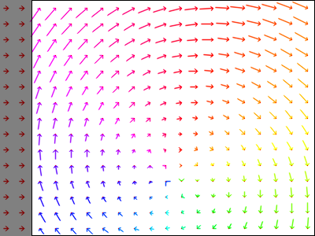

Introduction
============
Oflibpytorch: a handy python **o**\ ptical **f**\ low **lib**\ rary, based on **PyTorch** tensors, that enables the
manipulation and combination of flow fields while keeping track of valid areas (see "Usage"). It is mostly code
written from scratch, but also contains useful wrappers for specific functions from libraries such as PyTorch's
``grid_sample``, to integrate them with the custom flow field class introduced by oflibpytorch.

An equivalent flow library based on NumPy arrays exists. Its code is on GitHub_, and the documentation can be found on
`ReadTheDocs`_. Oflibpytorch is aimed at allowing the same operations to be performed with torch tensors instead of
numpy arrays as far as currently feasible, and on the GPU if required.

.. _GitHub: https://github.com/RViMLab/oflibnumpy
.. _ReadTheDocs: https://oflibnumpy.readthedocs.io

**Features:**

- Provides a custom flow field class for both backwards and forwards ('source' / 'target' based) flow fields
- Provides a number of class methods to create flow fields from lists of affine transforms, or a transformation matrix
- Provides a number of functions to resize the flow field, visualise it, warp images, find necessary image padding
- Allows for three different types of flow field combination operations
- Keeps track of valid flow field areas through said operations

**Installation:**

In order for oflibpytorch to work, the python environment needs to contain a PyTorch installation. To enable GPU usage,
the CUDA Toolkit is required as well. As it is difficult to guarantee an automatic installation via pip will use the
correct versions and work on all operating systems, it is left to the user to install :mod:`pytorch` and
:mod:`cudatoolkit` independently. The easiest route is a virtual conda environment and the recommended install command
from the `PyTorch website`_, configured for the user's specific system. To install oflibpytorch itself, use the
following command:

.. _PyTorch website: https://pytorch.org

.. code-block::

    pip install oflibpytorch

**Code example:**

.. code-block:: python

    import oflibpytorch as of
    # Make a flow field and display it
    shape = (300, 400)
    flow = of.Flow.from_transforms([['rotation', 200, 150, -30]], shape)
    flow.show()

.. code-block:: python

    # Combine sequentially with another flow field, display the result
    flow_2 = of.Flow.from_transforms([['translation', 40, 0]], shape)
    result = of.combine_flows(flow, flow_2, mode=3)
    result.show(show_mask=True, show_mask_borders=True)

.. code-block:: python

    result.show_arrows(show_mask=True, show_mask_borders=True)

Contents
========

.. toctree::
    :maxdepth: 2

    self
    usage
    documentation
    licensing
