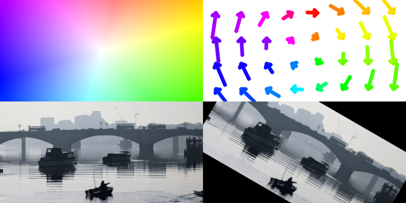

Introduction
============

**Oflibpytorch:** a handy python **o**\ ptical **f**\ low **lib**\ rary, based on **PyTorch** tensors, that enables
the manipulation and combination of flow fields while keeping track of valid areas (see "Usage"). It is mostly code
written from scratch, but also contains useful wrappers for specific functions from libraries such as PyTorch's
``grid_sample``, to integrate them with the custom flow field class introduced by oflibpytorch. Importantly, the
**main methods are differentiable** with respect to their flow field tensor inputs, allowing for a seamless
integration with machine learning algorithms.

If you use this code, please acknowledge us with the following citation:

.. code-block:: text

    @article{ravasio_oflib,
      title     = {oflibnumpy {\&} oflibpytorch: Optical Flow Handling and Manipulation in Python},
      author    = {Ravasio, Claudio S. and Da Cruz, Lyndon and Bergeles, Christos},
      journal   = {Journal of Open Research Software (JORS)},
      year      = {2021},
      volume    = {9},
      publisher = {Ubiquity Press, Ltd.},
      doi       = {10.5334/jors.380}
    }

An equivalent flow library based on NumPy arrays exists. Its code is on GitHub_, and the documentation can be found on
`ReadTheDocs`_.

.. _GitHub: https://github.com/RViMLab/oflibnumpy
.. _ReadTheDocs: https://oflibnumpy.readthedocs.io

**Features:**

- All main methods that return a float tensor are differentiable with respect to tensor inputs
- A custom flow field class :class:`~oflibpytorch.Flow` for both backward and forward ('target' / 'source' based)
  flow fields, handled as tensors with a batch dimension, allowing for efficient batch-wise processing that can be
  performed on GPU if desired
- A number of class methods to create flow fields from lists of affine transforms, or a transformation matrix, as
  well as methods to resize the flow field, visualise it, warp images, or find necessary image padding, all while
  keeping track of valid flow field areas
- A class method to process three different types of flow field combination operations
- Utility functions including a PyTorch-based approximate interpolation to a grid from unstructured data as a
  replacement for :func:`scipy.interpolate.griddata`

**Installation:**

In order for oflibpytorch to work, the python environment needs to contain a PyTorch installation. To enable GPU usage,
the CUDA Toolkit is required as well. As it is difficult to guarantee an automatic installation via pip will use the
correct versions and work on all operating systems, it is left to the user to install :mod:`pytorch` and
:mod:`cudatoolkit` independently. The easiest route is a virtual conda environment and the recommended install command
from the `PyTorch website`_, configured for the user's specific system. To install oflibpytorch itself, use the
following command:

.. _PyTorch website: https://pytorch.org

.. code-block::

    pip install oflibpytorch

**Testing:**

In the command line, navigate to the folder ``oflibpytorch/test`` and run:

.. code-block::

    python -m unittest discover .

**Code example:**

.. code-block:: python

    import oflibpytorch as of
    # Make a flow field and display it
    shape = (300, 400)
    flow = of.Flow.from_transforms([['rotation', 200, 150, -30]], shape)
    flow.show()

.. image:: ../docs/_static/index_flow_1.png
    :width: 50%
    :alt: Visualisation of optical flow representing a rotation

.. code-block:: python

    # Combine sequentially with another flow field, display the result
    flow_2 = of.Flow.from_transforms([['translation', 40, 0]], shape)
    result = flow.combine_with(flow_2, mode=3)
    result.show(show_mask=True, show_mask_borders=True)

.. image:: ../docs/_static/index_result.png
    :width: 50%
    :alt: Visualisation of optical flow representing a rotation, translated to the right

.. code-block:: python

    result.show_arrows(show_mask=True, show_mask_borders=True)

Contents
========

.. toctree::
    :maxdepth: 2

    self
    usage
    documentation
    licensing
    changelog
