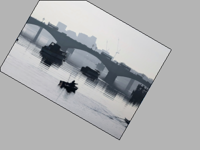
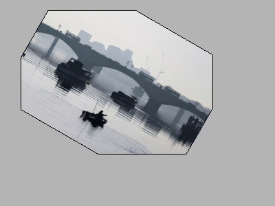
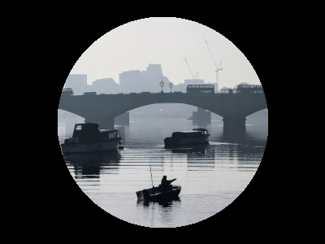
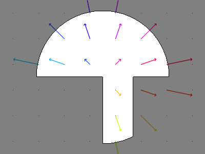
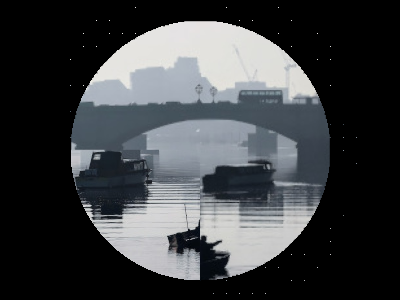
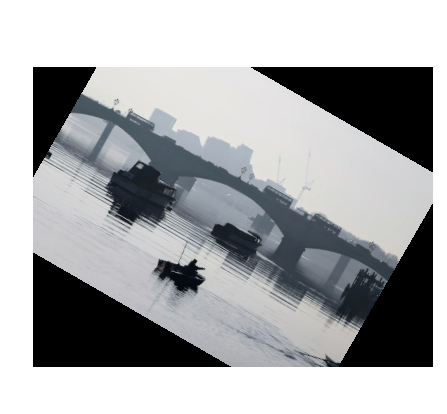
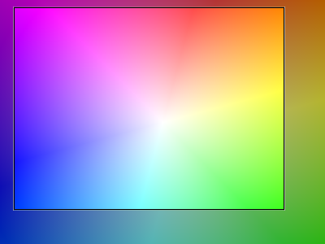

Usage
=====
This section aims to illustrate the benefits of ``oflibpytorch`` with examples. In all sample code, it is assumed that the
library was imported using the command ``import oflibpytorch as of``, and therefore the flow class can be accessed using
``of.Flow`` and the functions using ``of.<function>``. All the main examples use class methods instead of the
alternative array-based functions. These work much the same way, but are more limited in their capabilities and
therefore do not illustrate the full scope of ``oflibpytorch``. For some examples, see the section ":ref:`Tensor-Based
Functions`".

Note that :mod:`oflibpytorch` is an adaption of :mod:`oflibnumpy` (see `code`_ and `documentation`_) to the use of
torch tensors instead of numpy arrays as far as currently feasible, functionally largely equivalent. Using torch
tensors is advantageous e.g. for work with deep learning models, where image data, points tracked, as well as the
flow fields themselves might be available as a torch tensor, possibly on GPU. However, due to the current lack of
a PyTorch function that interpolates from unstructured data, some :mod:`oflibpytorch` still need to fall back on
the slower and CPU-only SciPy :func:`griddata` function (see the section ":ref:`The Flow Reference`" and
:meth:`~oflibpytorch.Flow.apply`).

.. _code:  https://github.com/RViMLab/oflibnumpy
.. _documentation: https://oflibnumpy.rtfd.io

The Flow Object
---------------
The custom flow object introduced here has four attributes: vectors :attr:`~oflibpytorch.Flow.vecs`, reference
:attr:`~oflibpytorch.Flow.ref` (see the section ":ref:`The Flow Reference`"), mask :attr:`~oflibpytorch.Flow.mask`
(see the section ":ref:`The Flow Mask`"), and device :attr:`~oflibpytorch.Flow.device`. It can be initialised using
just a torch tensor or a numpy array containing the flow vectors, or with one of three special constructors:

- :meth:`~oflibpytorch.Flow.zero` requires a desired shape :math:`(H, W)`, and optionally the flow reference, a mask,
  or the desired torch device. As the name indicates, the vectors are zero everywhere.
- :meth:`~oflibpytorch.Flow.from_matrix` requires a :math:`3 \times 3` transformation matrix, a desired shape
  :math:`(H, W)`, and optionally the flow reference, a mask, or the desired torch device. The flow vectors at each
  location in :math:`H \times W` are calculated to correspond to the given matrix.
- :meth:`~oflibpytorch.Flow.from_transforms` requires a list of transforms, a desired shape :math:`(H, W)`, and
  optionally the flow reference, a mask, or the desired torch device. The given transforms are converted into a
  transformation matrix, from which a flow field is constructed as in :meth:`~oflibpytorch.Flow.from_matrix`.
- :meth:`~oflibpytorch.Flow.from_kitti` loads the flow field (and optionally the valid pixels) from ``uint16`` ``png``
  image files, as provided in the `KITTI optical flow dataset`_.
- :meth:`~oflibpytorch.Flow.from_sintel` loads the flow field (and optionally the valid pixels) from ``flo`` files,
  as provided in the `Sintel optical flow dataset`_.

.. _KITTI optical flow dataset: http://www.cvlibs.net/datasets/kitti/eval_scene_flow.php?benchmark=flow
.. _Sintel optical flow dataset: http://sintel.is.tue.mpg.de/

Tensors are generally expected to follow the channel-first PyTorch convention (shape :math:`(C, H, W)`), and are the
standard input the functions are meant to interact with. If NumPy arrays are a valid input, they are generally expected
to follow the channel-last OpenCV convention (shape :math:`(H, W, C)`). All tensors belonging to a flow object are kept
on the same torch device, and inputs from a different device are automatically moved to the flow device if necessary.
Outputs are on the same device as the flow object as a standard. The attributes :attr:`vecs` and :attr:`mask` can be
accessed in PyTorch tensor form by calling ``flow.vecs`` (shape :math:`(2, H, W)`) or ``flow.mask``, or in NumPy array
form by calling ``flow.vecs_numpy`` (shape :math:`(H, W, 2)`) or ``flow.mask_numpy``.

Flow objects can be copied with :meth:`~oflibpytorch.Flow.copy`, resized with :meth:`~oflibpytorch.Flow.resize`, padded
with :meth:`~oflibpytorch.Flow.pad`, and sliced using square brackets ``[]`` analogous to numpy slicing, which calls
:meth:`~oflibpytorch.Flow.__get_item__` internally. They can also be added with ``+``, subtracted with ``-``, multiplied
with ``*``, divided with ``/``, exponentiated with ``**``, and negated by prepending ``-``. However, note that using
the standard operator ``+`` is **not** the same as sequentially combining flow fields, and the same goes for a
subtraction or a negation with ``-``. To do this correctly, use :meth:`~oflibpytorch.Flow.combine_with` (see the
section ":ref:`Combining Flows`").

Visualisation
-------------
The method :meth:`~oflibpytorch.Flow.visualise` returns a common visualisation mode for flow fields: the hue encodes the
flow vector direction, while the saturation encodes the magnitude. Unless a different value is passed, the maximum
saturation will correspond to the maximum magnitude present in the flow field. :meth:`~oflibpytorch.Flow.show` is a
convenience function that will display this visualisation in an OpenCV window using :func:`cv2.imshow`, useful e.g. for
debugging purposes. Note that the flow vectors, i.e. the attribute :attr:`~oflibpytorch.Flow.vecs`, are encoded in
"OpenCV convention": ``vecs[0]`` is the horizontal component of the flow, ``vecs[1]`` the vertical.

.. code-block:: python

    # Get an image of the flow visualisation definition in BGR colour space
    flow_def = of.visualise_definition('bgr')

    # Define a flow as a clockwise rotation and visualise it in BGR colour space
    shape = (601, 601)
    flow = of.Flow.from_transforms([['rotation', 601, 601, -30]], shape)
    flow_img = flow.visualise('bgr')

**Above:** *Left:* The definition of the flow visualisation, as output by :meth:`~oflibpytorch.visualise_definition`.
*Right:* the visualisation of a clockwise rotation around the lower right corner.

The :meth:`~oflibpytorch.Flow.visualise` method also offers two parameters, `show_mask` and `show_mask_borders`. This
will display the boolean mask :attr:`~oflibpytorch.Flow.mask` attribute of the flow object in the visualisation, by
reducing the image intensity where the mask is ``False``, and drawing a black border around all valid (``True``)
areas, respectively. For an explanation of the usefulness of this mask, see the section ":ref:`The Flow Mask`".

.. code-block:: python

    # Define a flow that is invalid in the upper left corner, and visualise it in BGR colour space
    shape = (601, 601)
    mask = np.ones((601, 601), 'bool')
    mask[:301, :301] = False
    flow = of.Flow.from_transforms([['rotation', 601, 601, -30]], shape, mask=mask)
    flow_img = flow.visualise('bgr', show_mask=True, show_mask_borders=True)

**Above:** The same clockwise rotation as before, but with a mask that defines the upper left quarter of the flow field
as "invalid". When ``show_mask = True``, this area has a reduced intensity. ``show_mask_borders = True`` adds a black
border around the valid area, i.e. the area where the :attr:`~oflibpytorch.Flow.mask` attribute of the flow is ``True``.

A second, more intuitive visualisation mode is offered in the :meth:`~oflibpytorch.Flow.visualise_arrows` method. Here,
the flow is drawn out as arrows with either their start or end points on a regular grid (see the documentation for the
reference :attr:`~oflibpytorch.Flow.ref` flow attribute). The colour of the arrows is calculated the same way as in
:meth:`~oflibpytorch.Flow.visualise` by default, but can be set to a different colour if needed. As with
:meth:`~oflibpytorch.Flow.visualise`, the `show_mask` and `show_mask_borders` parameters will visualise the flow mask
:attr:`~oflibpytorch.Flow.mask` attribute. And as before, the :meth:`~oflibpytorch.Flow.show_arrows` method is a
convenience function that will display this visualisation in an OpenCV window using :func:`cv2.imshow`.

.. code-block:: python

    # Define a flow as a clockwise rotation and visualise it in BGR colour space as arrows
    shape = (601, 601)
    flow = of.Flow.from_transforms([['rotation', 601, 601, -30]], shape)
    flow_img = flow.visualise_arrows(80)

    # Define the same flow, but invalid in the upper left corner, and visualise in BGR colour space as arrows
    mask = np.ones((601, 601), 'bool')
    mask[:301, :301] = False
    flow = of.Flow.from_transforms([['rotation', 601, 601, -30]], shape, mask=mask)
    flow_img_masked = flow.visualise_arrows(80, show_mask=True, show_mask_borders=True)

**Above:** *Left:* The same flow field as before, a clockwise rotation around the lower right corner, visualised as
arrows. *Right:* The flow field with the upper left corner defined as "invalid": this area is visualised with a lower
intensity, and the border of the valid area, where the flow mask attribute :attr:`~oflibpytorch.Flow.mask` is ``True``,
is drawn in black

The Flow Reference
------------------
The :attr:`~oflibpytorch.Flow.ref` attribute determines whether the regular grid of shape H-W associated with the flow
vectors should be understood as the source of the vectors, or the target. So given `img`\ :sub:`1` in the "source"
domain, `img`\ :sub:`2` in the "target" domain, and an associated flow field between the two, there are two possible
definitions or frames of reference for flow vectors:

- "Source" reference: The flow vectors originate from a regular grid corresponding to pixels in the area
  :math:`H \times W` in `img`\ :sub:`1`, the source domain. They therefore encode the motion that moves image
  values from this regular grid in `img`\ :sub:`1` to any location in `img`\ :sub:`2`, the target domain.
- "Target" reference: The flow vectors point to a regular grid corresponding to pixels in the area
  :math:`H \times W` in `img`\ :sub:`2`, the target domain. They therefore encode the motion that moves image
  values from any location in `img`\ :sub:`1`, the source domain, to this regular grid in `img`\ :sub:`2`.

The flow reference ``t`` is the default, and it is significantly faster to warp an image with a flow in that
reference. The reason is that reference ``t`` requires interpolating unstructured points from a regular
grid (also known as "backward" or "reverse" warping), while reference ``s`` requires interpolating a regular grid
from unstructured points ("forward" warping). The former uses the fast PyTorch :func:`grid_sample` function, the
latter is much more operationally complex and relies on the SciPy :func:`griddata` function. On the other hand, the
:meth:`~oflibpytorch.Flow.track` method for tracking points (see the section ":ref:`Tracking Points`") is significantly
faster with a flow in ``s`` reference, again due to not requiring a call to SciPy's :func:`griddata` function.

As the images below show, the same rotation will lead to slightly different flow vectors depending on which reference
is chosen. This illustrates that the reference attribute :attr:`~oflibpytorch.Flow.ref` cannot simply be set to a
different value if it needs to be changed. For this purpose, the method :meth:`~oflibpytorch.Flow.switch_ref` should be
used. However, this is slow, as it also calls :func:`scipy.interpolate.griddata`.

.. image:: ../docs/_static/ref_t_vectors_gridded.png
   :width: 49%
   :alt: Reference ``t`` (target)

**Above:** The same rotation with vectors of reference ``s`` (*left*) and ``t`` (*right*). Note that on the left, the
source of the arrows lies on the regular grid drawn in grey, while on the right, the tip of the arrows lies on the
same regular grid.

If the problem is that a specific algorithm that calculates the flow from a pair of images :func:`get_flow` is set up
to return a flow field in one reference, but the flow field in the other reference is required, there is a simpler
solution than using the method :meth:`~oflibpytorch.Flow.switch_ref`. Instead of calling
``flow_one_ref = get_flow(img1, img2)``, simply call the algorithm with the images in the reversed order, and multiply
the resulting flow vectors by -1: ``flow_other_ref = -1 * get_flow(img2, img1)``. If the flow is needed in both
references, it can even be faster to call :func:`get_flow` twice in the way explained above, rather than once and then
using the method :meth:`~oflibpytorch.Flow.switch_ref` once. However, this of course depends on the size of the flow
field, and the operational complexity of the algorithm used to calculate it.

From the previous observations, it also follows that inverting a flow is not a matter of simply inverting the flow
vectors. In flows with reference ``t``, this would mean the target location remains the same while the source switches
to the opposite side, while in flows with reference ``s``, this would mean the source location remains the same while
the target switches to the opposite side. Neither is correct: in actual fact, inverting the flow switches the source and
the target around. This means inverting the flow vectors *and* changing the reference:
:math:`F(vecs, t)^{-1} = F(-vecs, s)` and :math:`F(vecs, s)^{-1} = F(-vecs, t)`. If the flow is needed with the
original reference, :meth:`~oflibpytorch.Flow.switch_ref` would have to be called. The method
:meth:`~oflibpytorch.Flow.invert` does all this internally, and returns the mathematically correct inverse flow in
whichever reference needed.

.. code-block:: python

    # Define a flow
    flow = of.Flow.from_transforms([['rotation', 200, 150, -30]], (300, 300), 't')

    # Get the flow inverse: in the wrong way, and correctly in either reference
    flow_invalid_inverse = -flow
    flow_valid_inverse_t = flow.invert('t')
    flow_valid_inverse_s = flow.invert('s')

.. image:: ../docs/_static/usage_ref_flow.png
   :width: 49%
   :alt: A clockwise rotation as a flow field

**Above:** *Top:* A flow field corresponding to a clockwise rotation in reference ``t``, and the incorrect "inverse"
obtained by simply inverting the flow vectors, also in reference ``t``. *Bottom:* The correct inverse in reference
``s``, and the correct inverse in reference ``t``. Note the difference in the flow vectors between the correct and
incorrect inverse - the former describes a pure rotation, while the latter resembles a spiral.

In the images above, the inverse in reference ``s`` retains the entire area :math:`H \times W` as valid, while the
inverse in reference ``t`` has undefined areas. As with the example in the section ":ref:`The Flow Mask`", this is
not a limitation of the algorithm, but simply a consequence of the operations necessary to invert the flow.

The Flow Mask
-------------
The :attr:`~oflibpytorch.Flow.mask` attribute is necessary to keep track of which flow vectors in the
:attr:`~oflibpytorch.Flow.vecs` attribute are valid. This is useful e.g. when two flow fields are combined (see the
section ":ref:`Combining Flows`"):

.. code-block:: python

    # Define two flows, one rotation, one scaling motion
    shape = (300, 400)
    flow_1 = of.Flow.from_transforms([['rotation', 200, 150, -30]], shape)
    flow_2 = of.Flow.from_transforms([['scaling', 100, 50, 0.7]], shape)

    # Combine the flow fields
    result = flow_1.combine_with(flow_2, mode=3)

.. image:: ../docs/_static/usage_mask_flow1.png
    :width: 49%
    :alt: Flow 1 visualisation (rotation)

.. image:: ../docs/_static/usage_mask_result_masked.png
    :width: 49%
    :alt: Flow combination visualisation, masked

**Above:** *Top:* Flow 1 (rotation), Flow 2 (scaling). *Bottom:* Flow combination, plain and masked

The flow visualisations above illustrate how not the entire flow field area :math:`H \times W` will actually contain
valid or useful flow vectors after a flow combination operation, despite both flow fields used being entirely valid.
This is not a limitation of the algorithm, but unavoidable: the scaling operation can be pictured as a "zooming out"
motion, which obviously means there will be a "frame" of values that would have had to come from outside of
:math:`H \times W`, and are therefore undefined.

Applying a Flow
---------------
The :meth:`~oflibpytorch.Flow.apply` method is used to apply a flow field to an image (or any other torch tensor, or
indeed another flow field). Optionally, the ``valid_area`` can be returned, which will be ``True`` where the warped
image is valid, i.e. contains actual content. For an illustration, see the example below.

.. code-block:: python

    # Load image, and define a flow as a combination of a rotation and scaling motion
    img = cv2.imread('thames.jpg')  # 300x400 pixels
    transforms = [['rotation', 200, 150, -30], ['scaling', 100, 50, 0.7]]
    flow = of.Flow.from_transforms(transforms, img.shape[:2])

    # Apply the flow to the image, getting the "valid area"
    img = torch.tensor(np.moveaxis(img, -1, 0))
    warped_img, valid_area = flow.apply(img, return_valid_area=True)

**Above:** The result of applying a rotation and scaling motion to an image, with the black border showing the outline of
the returned ``valid_area``. As can be seen, the valid area matches the true image content exactly. *Left:* the flow
field used was the one from the code example above, valid everywhere. *Right:* the flow field used was the one from the
section ":ref:`The Flow Mask`", where the valid area is further reduced by the flow field itself having a reduced valid
area.

It is also possible to pass an image mask, e.g. a segmentation mask, into the :meth:`~oflibpytorch.Flow.apply` method,
which will be combined with the flow mask to eventually result in the ``valid_area``. This can be useful as in the
example below.

.. code-block:: python

    # Make a circular mask
    shape = (300, 350)
    mask = np.mgrid[-shape[0]//2:shape[0]//2, -shape[1]//2:shape[1]//2]
    radius = shape[0] // 2 - 20
    mask = np.linalg.norm(mask, axis=0)
    mask = mask < radius

    # Load image, make two images that simulate a moving telescope
    img = cv2.imread('thames.jpg')  # 300x400 pixels
    img1 = np.copy(img[:, :-50])
    img2 = np.copy(img[:, 50:])
    img1[~mask] = 0
    img2[~mask] = 0

    # Make a flow field that could have been obtained from the above images
    flow = of.Flow.from_transforms([['translation', -50, 0]], shape, 't', mask)
    flow.vecs[:, ~mask] = 0

    # Apply the flow to the image, setting consider_mask to True and False
    img1 = torch.tensor(np.moveaxis(img1, -1, 0))
    mask = torch.tensor(mask)
    warped_img, valid_area = flow.apply(img1, mask, return_valid_area=True)

.. image:: ../docs/_static/usage_apply_masked_flow_arrows.png
    :width: 49%
    :alt: The flow corresponding to the motion from Image 1 to 2
.. image:: ../docs/_static/usage_apply_masked_img_warped.png
    :width: 49%
    :alt: Image 1 warped by the flow, masked with the valid_area

**Above:** *Top:* Image 1 and image 2, as they could be seen when looking at the river Thames through a telescope.
*Bottom left:* The flow field corresponding to the motion from image 1 and image 2, a translation of 50px to the left.
The arrows show clearly that some of the pixels being moved originate outside of the field of view of the telescope,
which means the right-hand-side border of this field of view will be shifted towards the left, reducing the "useful"
image area. This cannot be avoided, as the parts of the image moving into view in image 2 are occluded in image 1.
*Bottom right:* the result of warping image 1 with the flow field, passing in the telescope field of view segmentation
from image 1 as a mask. The returned valid_area is shown as an overlay, and perfectly matches the location of the true
image content. So while the loss of "true content" area cannot be avoided, it can be tracked by passing the initial
segmentation into the function, and using ``return_valid_area = True`` to obtain an updated segmentation.

The examples above use a flow field with reference ``t``. This is the recommended standard for various reasons:

- Using :meth:`~oflibpytorch.Flow.apply` with flow fields of reference ``s`` is comparatively slow, as it needs to call
  SciPy's :func:`griddata` function.
- Flow fields of reference ``s`` can contain ambiguities, as vectors from two different locations can point to the same
  target location. This could happen if there are several independently moving objects in a scene which end up
  occluding each other. The only way of resolving this is to assign priorities to the flow vectors, which is left to a
  possible future version of :mod:`oflibpytorch`.
- Furthermore, flow fields of reference ``s`` do not deal well with undefined / invalid flow areas, as the example
  below shows. One option (the default) considers the flow mask, i.e. ignoring invalid flow vectors, which leads to a
  smoother result inside the convex hull of the flow target area but risks artefacts appearing. The other option,
  accessible by setting ``consider_mask = False``, is to use the invalid vectors anyway, which in this example inserts
  a lot of black image values in-between the desired image values which are to be interpolated onto the regular grid of
  the new image: this gets rid of the large artefact visible in the concave area, but does not allow the flow field to
  expand the image properly. In a future version of :mod:`oflibpytorch`, this could be at least partially solved by
  using the default option, but then calculating which image pixels are not in the concave hull, and setting those to
  zero. However, determining the convex hull of unstructured point clouds brings its own difficulties.

.. code-block:: python

    # Make a circular mask with the lower left corner missing
    shape = (300, 400)
    mask = np.mgrid[-shape[0]//2:shape[0]//2, -shape[1]//2:shape[1]//2]
    radius = shape[0] // 2 - 20
    mask = np.linalg.norm(mask, axis=0)
    mask = mask < radius
    mask[150:, :200] = False

    # Load image, make a flow field, mask both
    img = cv2.imread('thames.jpg')  # 300x400 pixels
    flow = of.Flow.from_transforms([['scaling', 200, 150, 1.3]], shape, 's', mask)
    img[~mask] = 0
    flow.vecs[:, ~mask] = 0

    # Apply the flow to the image, setting consider_mask to True and False
    img = torch.tensor(np.moveaxis(img, -1, 0))
    img_true = flow.apply(img, consider_mask=True)
    img_false = flow.apply(img, consider_mask=False)

.. image:: ../docs/_static/usage_apply_consider_mask_true.png
    :width: 49%
    :alt: Flow applied to the image considering the flow mask (default option)

**Above:** *Top:* The masked image and the equally masked flow with reference ``s``, corresponding to a scaling motion
from the image centre. *Bottom:* The result of applying the flow to the image, with / without considering the mask,
i.e. not using / using all flow vector values.

Flow Padding
------------
Given that applying a flow with reference ``t`` to an image can lead to undefined areas (as seen in the section
":ref:`Applying a Flow`"), it can be useful to know how much this image would have to be padded on each side with
respect to the given flow field in order for no undefined areas to show up anymore. A possible application for this
would be the creation of synthetic data for a deep learning optical flow estimation algorithm, with the goal of
obtaining two images and an associated flow field that corresponds to the motion visible between the two images.

The padding can be determined using the :meth:`~oflibpytorch.Flow.get_padding` method, and will be returned as a list of
values ``[top, bottom, left, right]``. If an image padded accordingly is passed to the :meth:`~oflibpytorch.Flow.apply`
method along with the padding values, the image will be warped according to the flow field and automatically cut down
to the size of the flow field, unless the parameter `cut` is set to ``False``.

.. code-block:: python

    # Load an image
    full_img = cv2.imread('thames.jpg')  # original resolution 600x800

    # Define a flow field
    shape = (300, 300)
    transforms = [['rotation', 200, 150, -30], ['scaling', 100, 50, 0.7]]
    flow = of.Flow.from_transforms(transforms, shape)

    # Get the necessary padding
    padding = flow.get_padding()

    # Select an image patch that is equal in size to the flow resolution plus the padding
    padded_patch = full_img[:shape[0] + sum(padding[:2]), :shape[1] + sum(padding[2:])]

    # Apply the flow field to the image patch, passing in the padding
    padded_patch = torch.tensor(np.moveaxis(padded_patch, -1, 0))
    warped_padded_patch = flow.apply(padded_patch, padding=padding)

    # As a comparison: cut an unpadded patch out of the image and warp it with the same flow
    patch = full_img[padding[0]:padding[0] + shape[0], padding[2]:padding[2] + shape[1]]
    patch = torch.tensor(np.moveaxis(patch, -1, 0))
    warped_patch = flow.apply(patch)

**Above:** *Left:* The original unpadded image patch. *Middle:* The unpadded image patch when warped with the same flow
field as the one used in the section ":ref:`Applying a Flow`". Note the similar amount of undefined areas visible in the
result. *Right:* The result of applying the flow to the image patch padded with the necessary amount of padding, and
then cut back to size. The padding was just large enough to avoid any undefined areas becoming visible.

For flows with reference ``s``, the above calculation of padding is not possible: after all, the flow vectors express
where pixels in the original image are "pushed" to, rather than where pixels in the warped image are "pulled" from.
Instead, the :meth:`~oflibpytorch.Flow.get_padding` method calculates the padding necessary to ensure no content
is being pushed outside of the image.

.. code-block:: python

    # Load an image, define a flow field
    img = cv2.imread('thames.jpg')  # 300x400 pixels
    transforms = [['rotation', 200, 150, -30], ['scaling', 100, 50, 0.9]]
    flow = of.Flow.from_transforms(transforms, img.shape[:2], 's')  # 300x400 pixels

    # Find the padding and pad the image
    padding = flow.get_padding()
    padded_img = np.pad(img, (tuple(padding[:2]), tuple(padding[2:]), (0, 0)))

    # Apply the flow field to the image patch, with and without the padding
    img = torch.tensor(np.moveaxis(img, -1, 0))
    padded_img = torch.tensor(np.moveaxis(padded_img, -1, 0))
    warped_img = flow.apply(img)
    warped_padded_img = flow.apply(padded_img, padding=padding, cut=False)

**Above:** *Left:* The original image warped with the flow - note the corners that have been moved outside of the image,
leading to loss of information. *Right:* The padded image warped with the flow: the image has been padded the exact
amount needed not to lose any image content.

Source and Target Areas
-----------------------
The :meth:`~oflibpytorch.Flow.valid_source` and :meth:`~oflibpytorch.Flow.valid_target` methods both serve to investigate
the flow field. Given an image with the area :math:`H \times W` in the source domain and a flow field of the same
shape, applying this flow to the image will give us a warped image in the target domain. Some of the original image
content will no longer be visible after applying the flow: :meth:`~oflibpytorch.Flow.valid_source` returns a boolean
tensor of shape :math:`(H, W)` which is ``False`` where content "disappears" after warping. The warped image, in turn,
will contain some areas which are undefined, i.e. not filled by any content from the original image:
:meth:`~oflibpytorch.Flow.valid_target` returns a boolean tensor of shape :math:`(H, W)` which is ``False`` where the
warped image does not contain valid content.

.. code-block:: python

    # Define a flow field
    shape = (300, 400)
    transforms = [['rotation', 200, 150, -30], ['scaling', 100, 50, 1.2]]
    flow = of.Flow.from_transforms(transforms, shape)

    # Get the valid source and target areas
    valid_source = flow.valid_source()
    valid_target = flow.valid_target()

    # Load an image and warp it with the flow
    img = cv2.imread('thames.jpg')  # 300x400 pixels
    img = torch.tensor(np.moveaxis(img, -1, 0))
    warped_img = flow.apply(img)

.. image:: ../docs/_static/usage_source_target_source.png
    :width: 49%
    :alt: Valid source area

**Above:** *Top:* Original image, and the image warped by the flow field. *Bottom left:* The valid source area - the
white area covers the parts of the original image ("source" domain) which are still visible after warping.
*Bottom right:* The valid target area - the white area covers the parts of the warped image ("target" domain) with
real image content.

Tracking Points
---------------
The :meth:`~oflibpytorch.Flow.track` method is useful to apply the flow field to a number of points rather than an
entire image. In the following example, the `int_out` parameter is set to ``True`` so the new point locations are
returned as (rounded) integers - this is a useful convenience feature if these points should then be plotted on an
image. By default, the method will return accurate float values.

An important point to be aware of is that the :meth:`~oflibpytorch.Flow.track` method is significantly faster for flows
with a "source" reference (``ref = 's'``).

.. code-block:: python

    # Define a background image, sample points, and a sample flow field
    background = np.zeros((40, 60, 3), 'uint8')
    pts = np.array([[5, 15], [20, 15], [5, 50], [20, 50]])
    flow = of.Flow.from_transforms([['rotation', 0, 0, -15]], background.shape[:2], 's')

    # Track the points with the flow field, and plot original positions in white, new positions in red
    tracked_pts = flow.track(torch.tensor(pts), int_out=True)
    background[pts[:, 0], pts[:, 1]] = 255
    background[tracked_pts[:, 0], tracked_pts[:, 1], 2] = 255

**Above:** Flow field, and point positions: original points in white, points after applying the flow in red

If the points are rotated more, some will come to lie outside of the image area. In this case, setting the parameter
`get_valid_status` to ``True`` will cause the :meth:`~oflibpytorch.Flow.track` method to return a boolean tensor which
lists the "status" of each output point. It will be ``True`` for any point that was moved by a valid flow vector (see
section ":ref:`The Flow Mask`") *and* remains inside the image area.

.. code-block:: python

    # Define a background image, sample points, and a sample flow field
    background = np.zeros((40, 60, 3), 'uint8')
    pts = np.array([[5, 15], [20, 15], [5, 50], [20, 50]])
    mask = np.ones((40, 60), 'bool')  # Make a flow mask
    mask[:15, :30] = False  # Set the left upper corner of the flow mask to False
    flow = of.Flow.from_transforms([['rotation', 0, 0, -25]], background.shape[:2], 's', mask)

    # Track the points with the flow field, and plot original positions in white, new positions in red
    tracked_pts, valid_status = flow.track(torch.tensor(pts), int_out=True, get_valid_status=True)
    background[pts[:, 0], pts[:, 1]] = 255
    background[tracked_pts[valid_status][:, 0], tracked_pts[valid_status][:, 1], 2] = 255

**Above:** Flow field, and point positions: original points in white, points after applying the flow in red. Note the
upper left and lower right points are missing, as they both have a `valid_status` of ``False``. For the upper left
point, this is due to the flow vector at that location having been defined as invalid (see the black border in the flow
field visualisation), as the mask used when creating the flow was set to ``False`` there. For the lower right point,
this is due to the new location of the point being outside of the image area.

Combining Flows
---------------
The :meth:`~oflibpytorch.Flow.combine_with` function was already used in the section ":ref:`The Flow Mask`" with
``mode = 3`` to sequentially combine two different flow fields. This is a fast operation both for reference ``s``
and ``t``. In the formula :math:`flow_1 ⊕ flow_2 = flow_3`, where :math:`⊕` corresponds to a flow combination
operation, this is equivalent to inputting :math:`flow_1` and :math:`flow_2`, and obtaining :math:`flow_3`.
However, it is also possible to obtain either :math:`flow_1` or :math:`flow_2` when the other flows in the equation
are known, by setting ``mode = 1`` or ``mode = 2``, respectively. These operations are comparatively slow due to
calls to SciPy's :func:`griddata`. The calculation will often lead to a flow field with some invalid areas, similar
to the example in the section ":ref:`The Flow Mask`".

.. code-block:: python

    shape = (300, 400)
    flow_1 = of.Flow.from_transforms([['rotation', 200, 150, -30]], shape)
    flow_2 = of.Flow.from_transforms([['scaling', 100, 50, 1.2]], shape)
    flow_3 = of.Flow.from_transforms([['rotation', 200, 150, -30], ['scaling', 100, 50, 1.2]], shape)

    flow_1_result = flow_2.combine_with(flow_3, mode=1)
    flow_2_result = flow_1.combine_with(flow_3, mode=2)
    flow_3_result = flow_1.combine_with(flow_2, mode=3)

**Above:** *Top:* Flows 1 through 3. *Bottom:* Flows 1 through 3, as calculated using
:func:`~oflibpytorch.Flow.combine_with`, matching the original flow fields. Note that the first flow field
has some invalid areas.

Tensor-Based Functions
----------------------
Almost all the class methods discussed above are also available as functions that take torch tensors or numpy arrays
representing flow fields as inputs directly. This can appear more straight-forward to use, but they are generally
more limited in their scope, and the user has to keep track of potentially changing flow attributes such as the
reference frame manually. Valid areas are also not tracked. It is recommended to make use of the custom flow class
for anything but the simplest flow operations.

.. code-block:: python

    # Define Torch tensor flow fields
    shape = (100, 100)
    flow = of.from_transforms([['rotation', 50, 100, -30]], shape, 's')
    flow_2 = of.from_transforms([['scaling', 100, 50, 1.2]], shape, 't')

    # Visualise Torch tensor flow field as arrows
    flow_vis = of.show_flow(flow, wait=2000)

    # Combine two Torch tensor flow fields
    flow_t = of.switch_flow_ref(flow, 's')
    flow_3 = of.combine_flows(flow_t, flow_2, 3, 't')

    # Visualise Torch tensor flow field
    flow_3_vis = of.show_flow_arrows(flow_3, 't')
